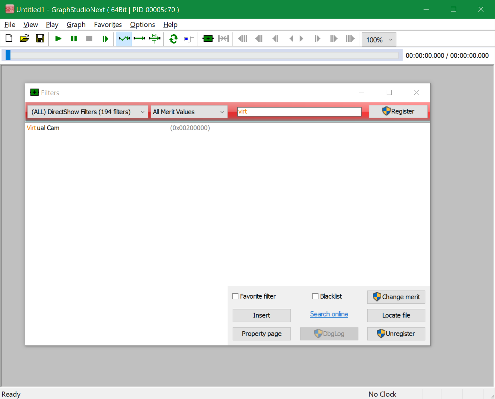
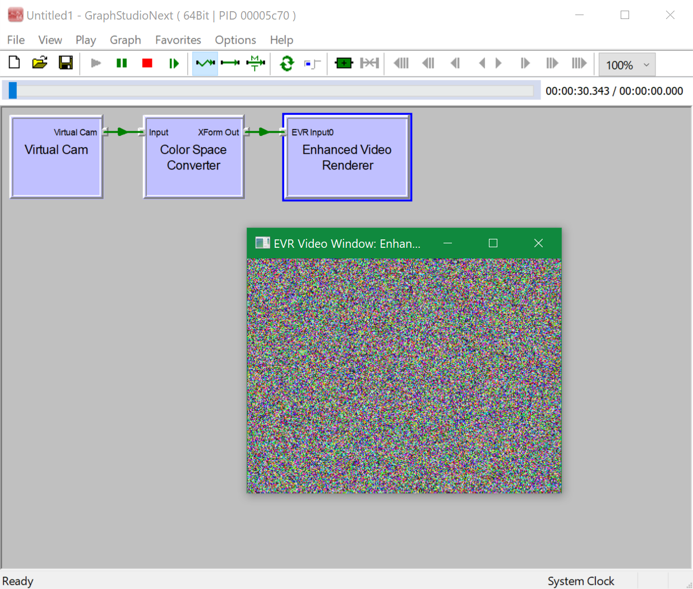

# DirectShow VCam

This repository contains [Vivek](https://groups.google.com/g/microsoft.public.win32.programmer.directx.video/c/1beZkSCb0KE/m/5VF366wR3CcJ)'s Capture Source Filter filter, a popular DirectShow sample project.

> Capture Source Filter filter (version 0.1) 86 KB zipped, includes binaries.  A sample source filter that emulates a video capture device contributed by Vivek (rep movsd from the public newsgroups).  Thanks Vivek!  TMH has not tested this filter yet.  Ask questions about this on microsoft.public.win32.programmer.directx.video.

This was hosted on [The March Hare's](https://web.archive.org/web/20060813155608/http://tmhare.mvps.org/) website for quite some time, and now when the website is gone people don't know where to look for the source code. Here it goes!

See also:

* [How to build and run Vivek's Virtual Camera on Windows 10?](https://stackoverflow.com/a/65698434/868014)
* [Errors in building Vivek's Virtual Camera on Windows 10?](https://stackoverflow.com/a/65758769/868014)

## Updates

Orignial source code is tagged by [original](https://github.com/roman380/tmhare.mvps.org-vcam/releases/tag/original) tag. In this state the project needs a bit of massaging to be beuilt.

The head of the repository is updated for Virtual Studio 2019 Community builds.

1. The project requires DirectShow BaseClasses, which is a part of Windows SDK moved to github. For this reason you need to pull https://github.com/roman380/Windows-classic-samples/tree/directshow/Samples/Win7Samples/multimedia/directshow (note branch "directshow") first and build the directshow.sln solution there (or at least BaseClasses project) first.
2. Then, edit [directshow.props](directshow.props) and modify line with `WindowsClassicSamplesDir` to have it point to root of repository from step 1 above
3. Then, open [vcam.sln](vcam.sln) and build this project

Differences from original version:

- output file name is Filters.dll (unlike original VCam.ax)
- the project is extended to have `x64` platform configuration

## How to use

Use Widows 10 SDK GraphEdit or [GraphStudioNext](https://github.com/cplussharp/graph-studio-next).

Locate "Virtual Cam" filter:

Build a pipeline and run:

## Further information

The VCam project has been discussed a lot in various forums. Most of them are archived and there are no active disussions, however there is still a lot of information online. Just a few pointers:

- https://social.msdn.microsoft.com/Forums/en-US/home?category=&forum=&filter=&sort=relevancedesc&brandIgnore=true&searchTerm=VCam
- https://groups.google.com/g/microsoft.public.win32.programmer.directx.video/search?q=VCam
- https://stackoverflow.com/search?q=VCam
